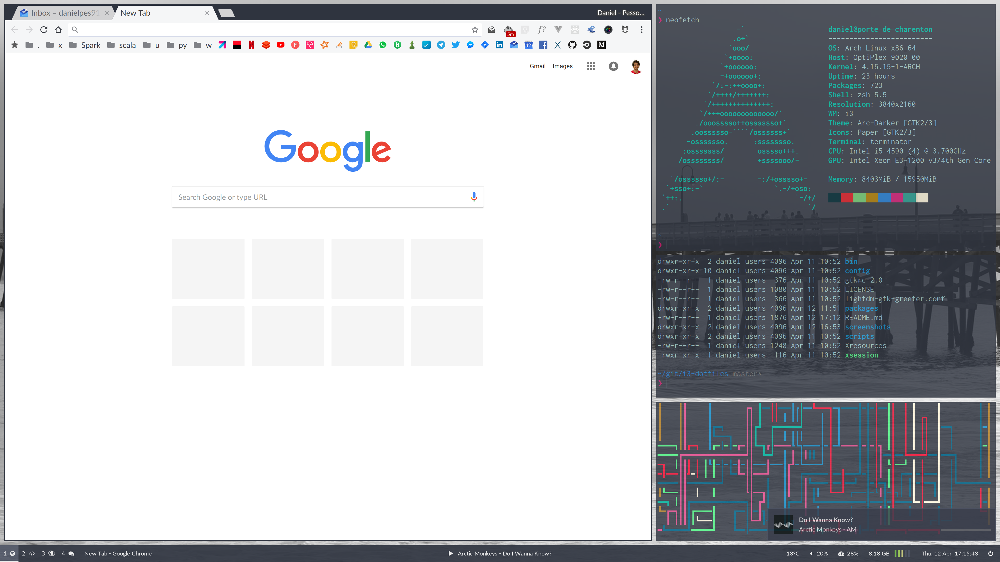
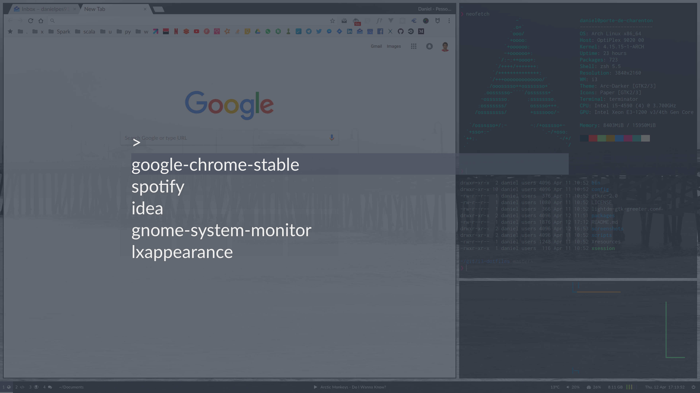

# i3-dotfiles

My configuration files for i3wm. It also includes my scripts for a brand new setup on a freshly installed Antergos Base system.

[Main Packages](#main-packages) 
[Theming](#theming) 
[Fonts](#fonts) 
[Hotkeys](#hotkeys) 
[Workspaces](#workspaces) 
[Wallpaper](#wallpaper) 

Some screenshots of the results:

 

## Main Packages

* [i3-gaps](https://github.com/Airblader/i3): The Window Manager. A fork of [i3wm](https://i3wm.org)
* [polybar](https://github.com/jaagr/polybar): For the bottom panel and task bar
* [compton](https://github.com/chjj/compton): Only for transparency
* [rofi](https://github.com/DaveDavenport/rofi): An application launcher
* [LightDM GTK Greeter](https://wiki.archlinux.org/index.php/LightDM#Greeter): For login, lock and session selection
* [dunst](https://github.com/dunst-project/dunst): A notification daemon
* [Terminator](https://gnometerminator.blogspot.fr/p/introduction.html): A terminal emulator

## Theming
* GTK2/GTK3: [Arc-Darker](https://github.com/horst3180/arc-theme)
* Icons: [Paper Icons](https://snwh.org/paper)
* Terminal: Home-made (colors based on a mix of Arc-Darker and Solarized Dark)
* VSCode: [Arc+ (Dark)](https://marketplace.visualstudio.com/items?itemName=ph-hawkins.arc-plus)

## Fonts

* Sans-serif: Lato
* Serif: PT Serif
* Monospace (terminal): Inconsolata
* Monospace (IDEs and Editors): Fira Code
* Monospace (others): Hack
* Icons: [Font Awesome 4](https://fontawesome.com/v4.7.0/), [Font Awesome 5](https://fontawesome.com/) and [Weather Icons](http://erikflowers.github.io/weather-icons/)
* Emoji: [Noto Color Emoji](https://www.google.com/get/noto/help/emoji/)

## Hotkeys

As a keyboard+mouse fan, I configure most of my keyboard shortcuts to be reachable with the left hand. Some shortcuts examples include:
* `Mod+w,a,s,d`: Navigate tiled windows
* `Mod+Shift+w,a,s,d`: Move focused tiled window
* `Mod+q,e`: Navigate workspaces
* `Mod+1,2,3,4,...`: Jump to workspace
* `Mod+z,x`: Resize focused container horizontally
* `Mod+Esc`: Close focused window
* `Mod+Space`: Open application launcher (rofi)
* `Mod+LClick+drag`: Move floating window
* `Mod+RClick+drag`: Resize floating window

## Workspaces

I currently use only 4 workspaces, with the following configuration:
* 1: For the browser and a column of terminals, on the right
* 2: For coding. Usually I leave VS code and IntelliJ Idea on a tabbed layout
* 3: For git. Usually I leave GitKraken here
* 4: Chat (Franz) and Music (Spotify)

## Wallpaper

I use the [Unsplash API](https://source.unsplash.com/) to get a random featured Full HD grayscale picture everytime I run a given script. The URL I use is the following:

https://source.unsplash.com/featured/1920x1080/?grayscale

